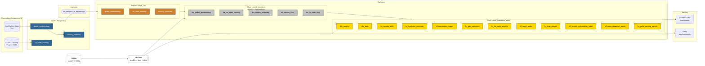

# COVID-19 Pipeline Architecture

```mermaid
flowchart LR

    %% ────── GENERATION / SOURCES ──────
    subgraph GEN["Generation (Assignment 1)"]
        OWID[(Our World in Data\nCSV)]
        CTP[(COVID Tracking\nProject JSON)]
    end

    %% ────── OLTP (Assignment 1 output) ──────
    subgraph OLTP["OLTP - PostgreSQL"]
        PG1[global_epidemiology]
        PG2[us_state_tracking]
        PG3[country_summary]
    end

    OWID --> PG1
    CTP  --> PG2
    PG1  --> PG3

    %% ────── INGESTION ──────
    subgraph INGEST["Ingestion"]
        SCRIPT{{03_postgres_to_bigquery.py}}
    end
    OLTP --> SCRIPT

    %% ────── BIGQUERY LAKEHOUSE ──────
    subgraph BQ["BigQuery"]
        subgraph BRONZE["Bronze - covid_raw"]
            B1[global_epidemiology]
            B2[us_state_tracking]
            B3[country_summary]
        end
        subgraph SILVER["Silver - covid_transform\n(staging + intermediate)"]
            S1[stg_global_epidemiology]
            S2[stg_us_state_tracking]
            S3[stg_country_summary]
            I1[int_country_daily]
            I2[int_us_state_daily]
        end
        subgraph GOLD["Gold - covid_transform_marts"]
            D1[dim_country]
            D2[dim_date]
            F1[fct_country_daily]
            F2[fct_continent_summary]
            F3[fct_vaccination_impact]
            F4[fct_gdp_outcomes]
            F5[fct_us_state_severity]
            F6[fct_wave_peaks]
            F7[fct_map_spread]
            F8[fct_country_vulnerability_index]
            F9[fct_wave_response_speed]
            F10[fct_early_warning_signals]
        end
    end

    SCRIPT  --> BRONZE
    BRONZE  --> SILVER
    SILVER  --> GOLD

    %% ────── dbt ──────
    DBT[[dbt Core\nmodels + tests + docs]]
    GIT[(GitHub\nmodels + YAML)]

    GIT --> DBT
    DBT --> SILVER
    DBT --> GOLD

    %% ────── SERVING ──────
    subgraph SERVE["Serving"]
        LS[Looker Studio\ndashboards]
        MAP[Plotly\nwave animation]
    end

    GOLD --> LS
    GOLD --> MAP

    %% ────── STYLING ──────
    classDef bronze fill:#cd7f32,color:#fff,stroke:#333
    classDef silver fill:#c0c0c0,color:#000,stroke:#333
    classDef gold   fill:#ffd700,color:#000,stroke:#333
    classDef oltp   fill:#336791,color:#fff,stroke:#333
    classDef tool   fill:#fff,color:#000,stroke:#333,stroke-dasharray:3 3

    class B1,B2,B3 bronze
    class S1,S2,S3,I1,I2 silver
    class D1,D2,F1,F2,F3,F4,F5,F6,F7,F8,F9,F10 gold
    class PG1,PG2,PG3 oltp
    class DBT,GIT tool
```
